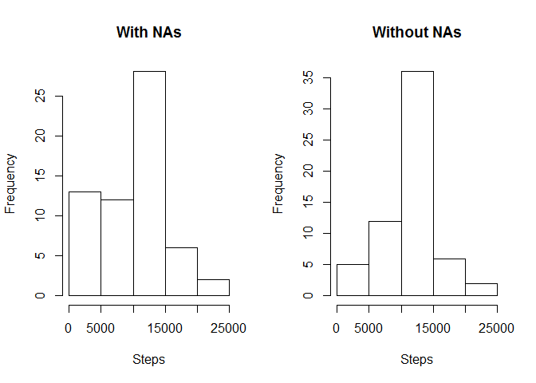

## Loading and preprocessing the data

```r
library(ggplot2)
if(!file.exists("activity.csv")){
unzip("RepData_PeerAssessment1/activity.zip")
}
activity <- read.csv("activity.csv")
activity$date <- as.POSIXct(activity$date,tz ="","%Y-%m-%d")
weekday <- weekdays(activity$date)
activity <- cbind(activity,weekday)
```

## What is mean total number of steps taken per day?

```r
stps_day <- with(activity,aggregate(steps, by = list(date), na.rm = TRUE, FUN = sum))
names(stps_day) <- c("date","steps")
hist(stps_day$steps, xlab = "Total steps taken per day")
```

<!-- -->

```r
mean(stps_day$steps)
```

```
## [1] 9354.23
```

```r
median(stps_day$steps)
```

```
## [1] 10395
```
## What is the average daily activity pattern?
- Make a time series plot (i.e.type="l") of the 5-minute interval (x-axis) and the average number of steps taken, averaged across all days (y-axis).

```r
intrvl_day <- with(activity, aggregate(steps, by = list(interval), na.rm = TRUE, FUN = mean))
names(intrvl_day)<-c("interval","mean")
plot(intrvl_day$interval,intrvl_day$mean, type = "l", xlab = "Interval(5min)", ylab = "Average steps taken")
```

<!-- -->

- Which 5-minute interval, on average across all the days in the dataset, contains the maximum number of steps?

```r
intrvl_day[which.max(intrvl_day$mean),]$interval
```

```
## [1] 835
```
## Imputing missing values
-  total number of missing values in the dataset (i.e. the total number of rows with NAs)

```r
sum(is.na(activity))
```

```
## [1] 2304
```
- Devise a strategy for filling in all of the missing values in the dataset and Create a new dataset that is equal to the original dataset but with the missing data filled in

```r
activity1 <- activity
activity1$steps[is.na(activity1$steps)] <- mean(na.omit(activity$steps))
```
- Make a histogram of the total number of steps taken each day and Calculate and report the mean and median total number of steps taken per day. Do these values differ from the estimates from the first part of the assignment? What is the impact of imputing missing data on the estimates of the total daily number of steps?

```r
stps_day1 <- with(activity1,aggregate(steps, by = list(date), na.rm = TRUE, FUN = sum))
names(stps_day1) <- c("date","steps")
par(mfrow = c(1,2))
hist(stps_day$steps, xlab = "Steps", main = "With NAs")
hist(stps_day1$steps,xlab = "Steps", main = "Without NAs")
```

<!-- -->

```r
mean(stps_day1$steps)
```

```
## [1] 10766.19
```

```r
median(stps_day1$steps)
```

```
## [1] 10766.19
```
## Are there differences in activity patterns between weekdays and weekends?

```r
activity$date <- as.Date(strptime(activity$date, format="%Y-%m-%d"))
activity$day <- sapply(activity$date, function(x){
        if (weekdays(x) == "Saturday" | weekdays(x) == "Sunday")
                {y <- "Weekend"} else
                {y <- "Weekday"}
        y
})
activity_day <- aggregate(steps~interval+day, activity, mean, na.rm = TRUE)
par(mfrow = c(2,1))
with(activity_day[activity_day$day == "Weekend",],plot(steps~interval, type = "l", main = "Weekend"))
with(activity_day[activity_day$day == "Weekday",],plot(steps~interval, type = "l", main = "Weekday"))
```

<!-- -->
